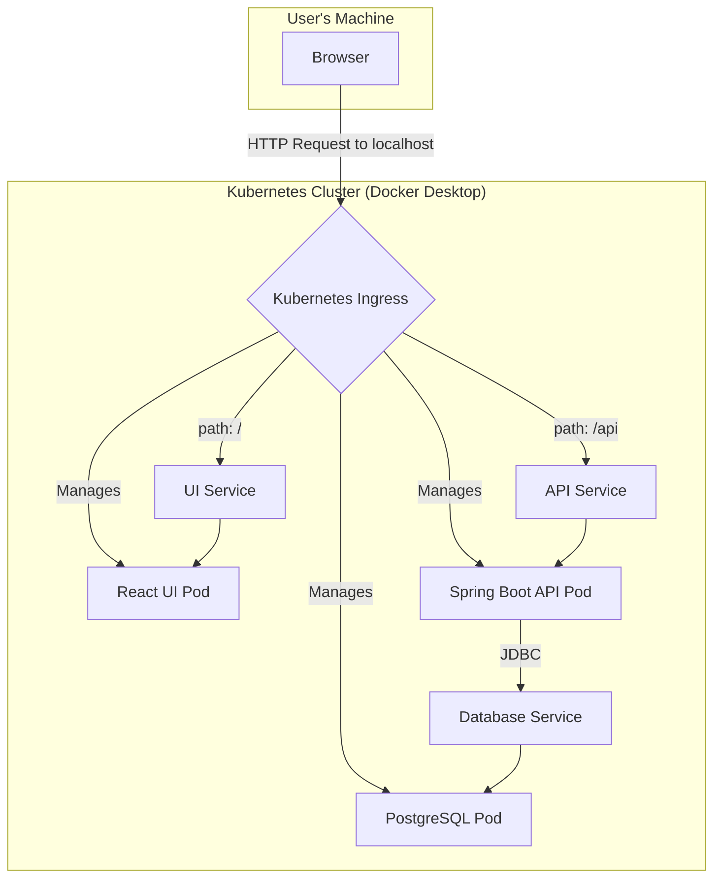

# Dynamic Professional Portfolio (Full-Stack & Cloud-Native)

This project is a comprehensive, full-stack, cloud-native portfolio application designed to showcase not only software development skills but also modern DevOps and Infrastructure as Code (IaC) practices. Unlike a traditional static HTML/CSS portfolio, this application is built with a scalable Java/Spring Boot backend, a dynamic React frontend, and is deployed entirely on Kubernetes using declarative manifests.

The entire lifecycle of the application, from testing to containerization to deployment artifact publishing, is fully automated via GitHub Actions.

## Table of Contents
- [Project Overview](#project-overview)
- [Live Architecture](#live-architecture)
- [Core Features](#core-features)
- [Technology Stack](#technology-stack)
- [Local Development & Deployment](#local-development--deployment)
  - [Prerequisites](#prerequisites)
  - [One-Command Setup](#one-command-setup)
- [Testing Strategy](#testing-strategy)
- [CI/CD GitOps Pipeline](#cicd-gitops-pipeline)
  - [Workflow 1: Continuous Integration](#workflow-1-continuous-integration)
  - [Workflow 2: Continuous Delivery (Artifact Publishing)](#workflow-2-continuous-delivery-artifact-publishing)
- [Future Improvements](#future-improvements)
- [Contact](#contact)
- [License](#license)

## Project Overview

The primary goal of this project is to serve as a real-world example of a modern software development lifecycle. It includes:
- A **Java backend** serving project data via a REST API.
- A **React frontend** that dynamically fetches and renders data from the API.
- **Containerization** of both services using multi-stage Dockerfiles for optimized and secure images.
- **Orchestration** using Kubernetes to manage the application, database, and networking declaratively.
- **Automation** via GitHub Actions to enforce code quality, run tests, and publish versioned Docker images to the GitHub Container Registry (GHCR).

## Live Architecture

The entire stack runs on Kubernetes, with traffic managed by an Nginx Ingress Controller. The declarative nature of the deployment means the entire architecture described below can be stood up from nothing with a single command.



## Core Features
- **Dynamic Project Display:** Project data is fetched from the backend API, not hardcoded in the frontend.
- **Declarative Deployment:** The entire application stack (including the Ingress Controller and secrets) is defined as code using Kubernetes manifests and Kustomize.
- **Automated Container Builds:** Every change merged to the `main` branch triggers a CI/CD pipeline that builds and publishes fresh, production-ready Docker images.
- **Zero-Downtime Principles:** The use of Kubernetes Deployments allows for rolling updates and self-healing.
- **Scalable Architecture:** Built on a microservices-style foundation that can be easily expanded.

## Technology Stack

### Backend
- ☕ **Java 17** & **Spring Boot 3**: For building a robust, enterprise-grade REST API.
- **Spring Data JPA**: For data persistence and repository management.
- **Maven**: For dependency management and build lifecycle.
- **Lombok**: To reduce boilerplate code.

### Frontend
- ⚛️ **React** & **Vite**: For a fast, modern, and interactive single-page application (SPA).
- **TypeScript**: For type safety and improved developer experience.
- **Axios**: For making API requests to the backend.
- **CSS**: For styling.

### Database
- 🐘 **PostgreSQL**: A powerful, open-source object-relational database system.

### DevOps & Infrastructure
- 🐳 **Docker**: For containerizing the frontend and backend applications into portable images.
- ☸️ **Kubernetes (k8s)**: For container orchestration, managing deployments, services, secrets, and networking.
- **Kustomize**: For declarative, template-free management of Kubernetes manifests.
- **Nginx Ingress Controller**: As the cluster's reverse proxy and entry point.
- 🚀 **GitHub Actions**: For complete CI/CD automation.
- **GitHub Container Registry (GHCR)**: For storing the published Docker images.

## Local Development & Deployment

### Prerequisites
- **Docker Desktop** with Kubernetes enabled.
- **Java JDK 17+**
- **Node.js v18+**
- **kubectl** (comes with Docker Desktop)

### One-Command Setup
Thanks to the declarative nature of Kustomize, the entire application stack—including the Nginx Ingress Controller, the database secret, and all application services—can be deployed with a single command from the project root.

```bash
# This command will:
# 1. Fetch the official Nginx Ingress Controller manifest.
# 2. Generate the PostgreSQL secret declaratively.
# 3. Apply all the application manifests (API, UI, Database).
kubectl apply -k k8s/
```
After a few minutes for images to pull and pods to start, the application will be available at `http://localhost`.

## Testing Strategy

- **Backend Unit & Integration Testing:** The project is configured with **JUnit 5** and **Mockito** for unit testing services and controllers. Integration tests using `@SpringBootTest` are also in place to test the full Spring application context, ensuring all layers work together correctly. Tests can be run via `mvn clean install` in the `api/` directory.

- **CI Validation:** The CI pipeline runs `mvn clean install` on every pull request, acting as a quality gate to prevent broken code from being integrated into the `develop` branch.

## CI/CD GitOps Pipeline

A professional GitFlow branching strategy (`develop` -> `main`) is used to separate integration from production releases. This is enforced by two distinct GitHub Actions workflows.

### Workflow 1: Continuous Integration (`build-and-test.yml`)
- **Trigger:** Runs on every push or pull request to the `develop` branch.
- **Purpose:** To act as a quality gate.
- **Actions:**
  1. Checks out the code.
  2. Sets up Java and Node.js environments.
  3. Runs `mvn clean install` on the backend to compile code and run all tests.
  4. Runs `npm run build` on the frontend to ensure it builds successfully.

### Workflow 2: Continuous Delivery (Artifact Publishing) (`build-and-push.yml`)
- **Trigger:** Runs **only** when a pull request is successfully merged into the `main` branch.
- **Purpose:** To create and publish the final, deployable release artifacts.
- **Actions:**
  1. Checks out the production-ready code from `main`.
  2. Logs in to the GitHub Container Registry.
  3. Builds the `portfolio-api` Docker image.
  4. Builds the `portfolio-ui` Docker image.
  5. Pushes both images with a `:latest` tag to GHCR, making them available for deployment.

## Future Improvements
- **Implement a Blog Engine:** Extend the backend to include a `BlogPost` entity and corresponding API endpoints.
- **Add Authentication:** Secure the API using Spring Security and JWT.
- **Introduce Monitoring:** Integrate Prometheus and Grafana for observability into the Kubernetes cluster.
- **Convert to Helm:** Package the entire application stack into a configurable Helm chart for even easier deployment.

